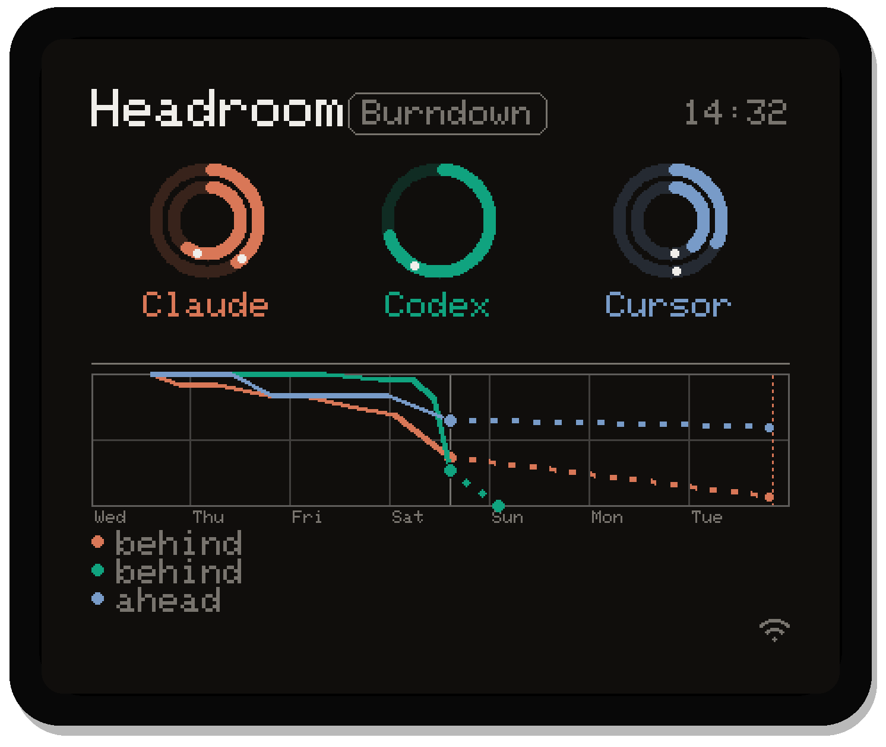
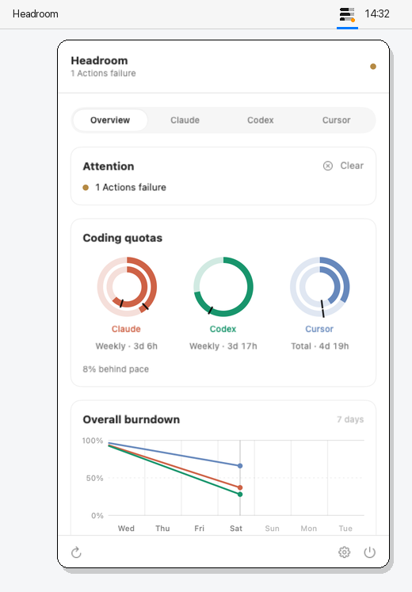
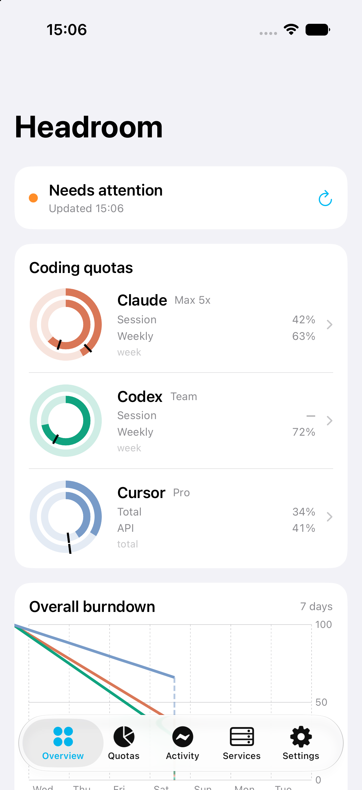

# Headroom

**Your AI coding quotas and ship status — on the desk, in the menu bar, and on your phone.**

When you're deep in Claude, Codex, or Cursor, you shouldn't have to dig through
billing pages, `gh`, and Vercel to answer: *Am I about to hit a limit? Did CI
go red? Is prod healthy?*

Headroom is a **local-first** desk gadget + macOS menu bar (+ optional iPhone)
that consolidates that into one glance:

| Always on | What you see |
|---|---|
| **ESP32 AMOLED** | Claude / Codex / Cursor quota rings, Vercel, git, local ports |
| **Menu bar** | Thin remaining-quota meters for enabled providers + amber/red attention pip |
| **Popover** | Overview rings, daily burn, spend, Activity / Services |
| **iPhone / iPad** | Quotas, burndown, activity, services, controls, notifications, widgets |

One Python host on your Mac reads local auth + CLIs and serves a single JSON
feed. No cloud account for Headroom itself — your tokens stay on the machine.

<p align="center">
  
</p>

<p align="center">
  
</p>

<p align="center">
  
</p>

```
  ~/.claude JSONL + OAuth          Mac (Python, stdlib)              Clients
  ~/.codex + Cursor state.vscdb    ┌──────────────────┐             ┌──────────────┐
  Vercel / git / gh / SB / Plaus. ─▶│ headroom_        │◀── HTTP ────│ Menu bar app │
  ~/.headroom/{config,sources}    │ server.py :8737  │◀── HTTP ────│ iPhone app   │
                                  │ + usb_bridge     │◀── HTTP/USB─│ ESP32 /usage │
                                  └──────────────────┘             └──────────────┘
```

**Hardware is optional.** The menu bar alone is useful. The Waveshare
ESP32-S3-Touch-AMOLED-1.8 (368×448) is the always-on desk glance — same feed,
tap a slot for detail, long-press to force-refresh.

## Why it exists

- **Quota anxiety is real.** Session / weekly windows, pace, and spend are
  scattered across products. Headroom puts hottest pool % + pace on one
  ring (and a menu-bar tick per enabled provider).
- **Ship status is ambient.** Failed Actions, Vercel builds, Supabase alerts,
  and listening local servers surface as an attention pip — not another tab.
- **Local-first.** The host talks to credentials and CLIs you already have.
  The board can fall back to USB CDC when hotel Wi‑Fi blocks mDNS.

## Requirements

| Need | Notes |
|---|---|
| macOS 14+ | Menu bar app |
| Python 3.9+ | Bundled host is **stdlib only** (system `/usr/bin/python3`) |
| At least one of Claude / Codex / Cursor | Already signed in locally |
| Optional: iPhone / iPad (iOS 17+) | Same LAN or Tailscale as the Mac |
| Optional: Xcode + [xcodegen](https://github.com/yonaskolb/XcodeGen) | Build from source / flash tooling |
| Optional: PlatformIO | Only if you flash the ESP32 |

No Headroom cloud account. Tokens stay on your Mac.

## Quick start

### Option A — macOS from a GitHub Release

1. Download **Headroom-macOS.zip** from
   [Releases](https://github.com/michellzappa/headroom/releases)
   (collaborators on this private repo). If no release exists yet, use Option B.
2. Unzip and open `Headroom.app` (notarized builds open normally;
   ad-hoc builds need right-click → Open once).
3. Click the menu bar meters → the **Welcome** sheet appears.
4. On a Release `.app`, the host **starts automatically** and installs a
   LaunchAgent so it stays up at login (and after you quit the menu bar).
   Use **Start host & keep at login** only if that didn’t happen.
5. Confirm which providers were detected (Claude / Codex / Cursor) → **Continue**.

### Option B — macOS from source

```bash
git clone https://github.com/michellzappa/headroom.git
cd headroom
./scripts/build-app.sh          # embeds host → dist/Headroom.app
open dist/Headroom.app
```

Or the two-piece flow (host from clone, debug app):

```bash
./scripts/install-host.sh
cd macos && ../scripts/sync-embedded-host.sh && xcodegen generate
xcodebuild -project Headroom.xcodeproj -scheme Headroom \
  -configuration Debug -derivedDataPath .build build
open .build/Build/Products/Debug/Headroom.app
```

**Foreground try** (no login item): `./scripts/install-host.sh --foreground`  
**Uninstall LaunchAgent:** `./scripts/uninstall-host.sh` (`--purge` wipes `~/.headroom`)

### Option C — iPhone

1. Install via the [TestFlight link](docs/install-links.md) when published,
   or build from source ([docs/ios-companion.md](docs/ios-companion.md)).
2. Keep the Mac host running (Option A/B).
3. On the phone: allow Local Network, pick your Mac under **Nearby Macs**.
4. On the Mac: **Settings → iPhone pairing → Copy mobile token**, paste once
   on the phone → **Connect**.

> The phone uses the **mobile token**. The ESP32 uses the separate **host token**.
> See [Tokens](#tokens-host-vs-mobile) below.

### First run (Mac)

- `~/.headroom/sources.json` is seeded from **local detection** — only providers
  that look signed-in are enabled. If none are found, all three quota sources
  stay on so the UI can show sign-in errors.
- The Welcome sheet lets you confirm toggles before the overview appears.
- Edit `~/.headroom/config.json` later for git authors / GitHub org / timezone.

```bash
curl -s localhost:8737/health | python3 -m json.tool
curl -s localhost:8737/setup  | python3 -m json.tool
```

### Two kinds of source

Onboarding and Settings keep them apart, because they answer different
questions and take different setup:

- **AI coding tools** — Claude, Codex, Cursor. How much plan is left. Read
  from the sign-in already on the Mac, so there is nothing to paste.
- **Dev tools** — Vercel, Git, GitHub Actions, Supabase, Plausible, local
  servers. What your projects are doing. Some want a key, pasted once in
  **Mac Settings** (Keychain — never sent to the phone or written into
  `/usage`).

| Dev tool | Where |
|---|---|
| **GitHub Actions** | Settings → GitHub token (or `gh` / `HEADROOM_GITHUB_TOKEN`) |
| **Supabase** | Settings → Supabase PAT |
| **Plausible** | Settings → Plausible Stats API key |
| **Vercel** | Already signed into the Vercel CLI |
| **Git / local servers** | `dev_root` + `git_authors` in `~/.headroom/config.json` |

Both lists toggle under Settings, each in its own section (the same flags
drive the menu bar, overview rings, iPhone, and ESP32 pages).

**Order picks the top 3.** The AI list is drag-ordered with the ▲▼ controls in
Settings, and that order is pinned in `~/.headroom/sources.json`. Compact
surfaces — the menu-bar tanks and the iOS widget — show the first three
*enabled* providers. The host does the picking and ships the ids as `focus` in
`/usage`, so the Mac, the phone, and its widget never disagree about which
three even when one of them is a poll behind. A provider added in a later
release lands at the end of your order instead of jumping the queue.

### ESP32 desk display (optional)

1. `cp firmware/src/config_example.h firmware/src/config.h` — Wi‑Fi SSIDs +
   Mac hostname (`scutil --get LocalHostName`) or fallback IP.
2. Paste the **host token** into `HOST_TOKEN` (`~/.headroom/token` after first
   start — not the mobile token).
3. `cd firmware && pio run -t upload && pio device monitor`

Wi‑Fi first; USB CDC fallback when LAN fails. **Tap** a glance slot for detail;
**long-press** home → `POST /sync/refresh`.

### Tokens (host vs mobile)

`/usage` carries repo names, commit subjects, local paths/ports, and spend.
The host binds `0.0.0.0` so LAN clients can reach it — **non-loopback callers
must present a token**. Loopback (menu bar, `curl localhost`) needs nothing.

| Name | File | Who uses it |
|---|---|---|
| **Host token** | `~/.headroom/token` | ESP32 (`HOST_TOKEN`), any generic LAN client |
| **Mobile token** | `~/.headroom/mobile-token` | iPhone only (Mac Settings → **Copy mobile token**) |

Send either as `X-Headroom-Token:` or `Authorization: Bearer`. The mobile token
is scoped by Mac Settings → iPhone pairing permissions (`read` / `refresh` /
`sources` / `servers`). Override the host token with `auth_token`, or open the
LAN with `"require_auth": false`, in `~/.headroom/config.json`.

### Troubleshooting

| Symptom | Fix |
|---|---|
| Welcome / host isn’t running | Tap **Start host & keep at login** in the popover |
| Host unhealthy | `tail -f ~/.headroom/logs/headroom.err` |
| Empty provider | Sign into that app/CLI; enable under Settings → AI coding tools |
| Empty dev tool | Paste its key under Settings, then enable it under Dev tools |
| iPhone won’t pair | Confirm **mobile token** (not host token); Local Network allowed |
| Gatekeeper blocks .app | Prefer a [notarized Release](https://github.com/michellzappa/headroom/releases); otherwise right-click → Open. Signing setup: [docs/releasing.md](docs/releasing.md) |
| Restart host | `launchctl kickstart -k gui/$(id -u)/com.centaur-labs.headroom` |
| Build a fresh .app | `./scripts/build-app.sh` → `dist/Headroom.app` |

## What it tracks

**AI coding tools** — plan left, and what it cost:

| Source | How |
|---|---|
| Claude | Keychain OAuth → Anthropic usage; token *value* via `pricing.py` |
| Codex | `~/.codex/auth.json` → weekly window, pace, reset credits, spend |
| Cursor | `state.vscdb` → Auto / API / total + on-demand |
| Copilot | GitHub token → premium / chat quota |
| Gemini | `~/.gemini` OAuth → Pro / Flash buckets |
| Windsurf | IDE plan cache → daily / weekly |
| JetBrains AI | Local `AIAssistantQuotaManager2.xml` → monthly credits |
| Zed | Keychain session → edit-prediction quota |
| Daily burn | Per-day %-point burn across enabled coding providers |

**Dev tools** — what the projects are doing:

| Source | How |
|---|---|
| Vercel | CLI auth → recent team deployments |
| Git | Commits under `dev_root` matching `git_authors` |
| GitHub Actions | Failed / running runs (Settings token / Keychain / `gh`) |
| Supabase | Project health via Settings PAT |
| Plausible | Site visitors / realtime via Settings Stats API key |
| Local servers | `lsof` TCP LISTEN → labeled ports (stop from the menu bar) |

Failures keep the last-good snapshot (`cache_util.keep_stale`). Each row is one
entry in `SOURCES` in `host/sources_config.py`, tagged `group="ai"` or
`group="devtools"` — that tag is what splits the two lists in onboarding and
Settings. Adding a dev tool is one registry entry; adding a coding provider is
one entry + a fetcher module.

## Reference

### Personal config (`~/.headroom/config.json`)

| Key | Purpose |
|---|---|
| `timezone` | Local day boundary for burn + timestamps |
| `dev_root` | Where git / GitHub repo discovery walks |
| `git_authors` | `git log --author` patterns (empty = all authors) |
| `vercel_team_slugs` | Preferred Vercel team(s); empty → CLI current team |
| `github_org_prefix` | Org filter for discovered Actions repos |
| `github_always_repos` | Always-watched `owner/name` list |
| `github_max_discovered` | Cap on auto-discovered org repos |
| `plausible_sites` | Optional domain filter / fallback when the key cannot list sites |
| `plausible_host` | Cloud or self-hosted base URL (default `https://plausible.io`) |
| `plausible_range` | Primary window: `day`, `24h` (default), `7d`, or `30d` |
| `auth_token` | Override the generated **host token** |
| `require_auth` | `false` opens `/usage` to the whole network (default `true`) |
| `mobile_permissions` | iOS grants: `read`, `refresh`, `sources`, `servers` |

### Endpoints

Everything below is loopback-open and token-gated off-box.

| Path | Notes |
|---|---|
| `GET /usage` | Full flat JSON for the menu bar |
| `GET /usage?view=device` | ~2KB projection the ESP32 polls |
| `GET /health` | Host `version` + `build`, uptime, compact source status, cache age |
| `GET /setup` | Detected credentials + enabled map (first-run sheet) |
| `GET /mobile/permissions` | Four effective permissions for the paired iOS app |
| `POST /sync/refresh` | Force-refresh (LAN OK — ESP32 long-press) |
| `POST /sources` | Toggle sources (`enabled` map) and/or pin provider order (`order` list). Loopback or paired iOS with `sources` scope |
| `POST /supabase/refresh` | Force Supabase poll (loopback) |
| `POST /plausible/refresh` | Force Plausible poll (loopback) |
| `POST /local/stop` | Stop server (loopback or paired iOS with `servers` scope) |
| `POST /attention/ack` | Clear the current warning everywhere until its reasons change |
| `POST /mobile/permissions` | Replace iOS grants (loopback/Mac settings only) |

The served document is rebuilt once per poll tick and cached as bytes.
`attention.level` is `ok` | `warn` | `critical` — acknowledgement is stored by
fingerprint so clearing on one surface clears the same warning everywhere.

### Host version

launchd keeps whatever host it was given running across app updates, so the
menu bar can end up reading a build it never shipped. `/health` reports
`version` (`host/VERSION`) and `build` (fingerprint of shipped `.py` files).
The app offers **Update host** in the popover when the two disagree.

macOS / iOS marketing versions track `host/VERSION`; `CFBundleVersion` is the
git commit count. Cut releases with `./scripts/cut-release.sh` — see
[docs/releasing.md](docs/releasing.md).

### Tests

```bash
cd host && python3 -m unittest discover -p "test_*.py"
cd macos && xcodegen generate && xcodebuild test -project Headroom.xcodeproj -scheme Headroom -derivedDataPath .build
cd firmware && pio run
```

`host/test_contract.py` and `macos/Tests/ContractTests.swift` pin the `/usage`
shape. CI runs host + firmware + macOS on push (`.github/workflows/ci.yml`).

Shared chrome names live in [`docs/glossary.md`](docs/glossary.md) /
`Shared/HeadroomCopy.swift`.

## Board notes

Waveshare **ESP32-S3-Touch-AMOLED-1.8**. SH8601 over QSPI; AXP2101 + TCA9554
must come up before the panel — see `firmware/src/main.cpp` / `pin_config.h`.

**Black screen?** Try `TCA9554_ADDR = 0x21` in `pin_config.h` (some revisions
strap the expander there). `pio device monitor` and the USB bridge cannot share
the port.

## More docs

| Doc | For |
|---|---|
| [docs/ios-companion.md](docs/ios-companion.md) | iPhone build, pairing, widgets |
| [docs/appstore.md](docs/appstore.md) | App Store listing copy + screenshot plan |
| [docs/privacy.md](docs/privacy.md) | Privacy policy (ASC URL) |
| [docs/install-links.md](docs/install-links.md) | Release + TestFlight URLs |
| [docs/releasing.md](docs/releasing.md) | Notarize, TestFlight, `cut-release` |
| [docs/glossary.md](docs/glossary.md) | Shared chrome names |
| [docs/rings.md](docs/rings.md) | Ring / pace semantics |

## License

MIT — see [LICENSE](LICENSE).
