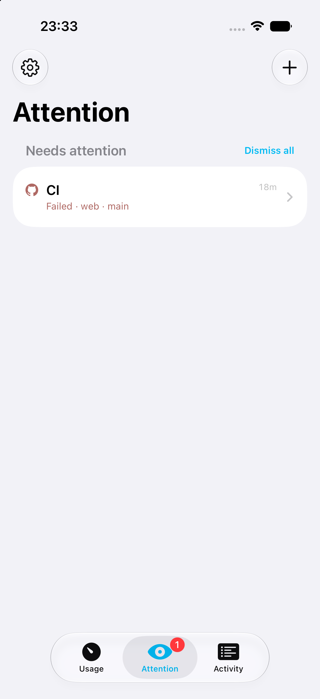
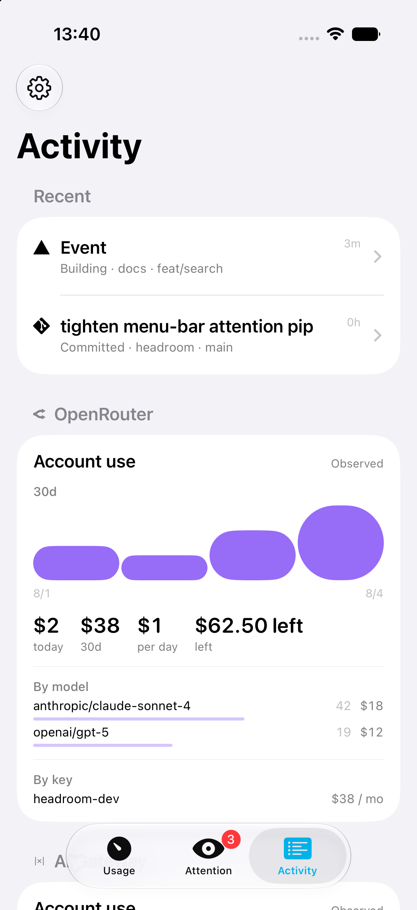

# Headroom

**Your AI coding quotas and ship status — in the menu bar, on your phone, and
optionally on the desk.**

When you're deep in Claude, Codex, or Cursor, you shouldn't have to dig through
billing pages, `gh`, and Vercel to answer: *Am I about to hit a limit? Did CI
go red? Is prod healthy?*

Headroom is a **local-first** macOS menu bar app (+ optional iPhone / Watch).
One Python host on your Mac reads the auth and CLIs you already have and serves
a single JSON feed. No Headroom cloud account — tokens stay on the machine.

| Surface | What you see |
|---|---|
| **Menu bar** | Thin remaining-quota tanks for the first three enabled providers + amber/red attention pip |
| **Popover** | Overview rings, daily burn, spend, Activity / Services |
| **Notification Center** | Same widget as the iPhone: rings small, combined burndown medium |
| **iPhone / iPad** | Quotas, burndown, activity, services, controls, notifications, widgets |
| **Apple Watch** | Two complications: rings, or the week's burndown |
| **ESP32 desk board** *(optional)* | Same three rings + burndown on a Waveshare AMOLED — [docs/esp32.md](docs/esp32.md) |

<p align="center">
  
</p>

<p align="center">
  
  
  
</p>

```
  ~/.claude / ~/.codex / Cursor / …     Mac (Python, stdlib)           Clients
  Vercel · git · gh · SB · Plaus.   ──▶│ headroom_server.py :8737 │◀── menu bar
  ~/.headroom/{config,sources}         │ + usb_bridge             │◀── iPhone
                                       └──────────────────────────┘◀── ESP32 (opt.)
```

## Why it exists

- **Quota anxiety** — session / weekly windows, pace, and spend on one ring
  (and a menu-bar tick per provider in focus).
- **Ship status ambient** — failed Actions, Vercel, Supabase, local servers as
  an attention pip, not another tab.
- **Local-first** — credentials and CLIs you already have; optional board can
  fall back to USB when hotel Wi‑Fi blocks mDNS.

## Requirements

| Need | Notes |
|---|---|
| macOS 14+ | Menu bar app |
| Python 3.9+ | Bundled host is **stdlib only** (system `/usr/bin/python3`) |
| At least one AI coding tool | Already signed in locally |
| Optional: iPhone / iPad (iOS 17+) | Same LAN or Tailscale as the Mac |
| Optional: PlatformIO | Only to flash the desk board |

No Headroom cloud account.

## Quick start

### 1. Mac app (Release)

1. Download **Headroom-macOS.zip** from
   [Releases](https://github.com/michellzappa/headroom/releases).
2. Open `Headroom.app` → menu bar meters → **Welcome**.
3. On a Release build the host starts automatically and stays up at login.
4. Confirm detected providers → **Continue**.

Build from source, Xcode, and signing: [macos/README.md](macos/README.md).

### 2. iPhone (optional)

[TestFlight](docs/install-links.md) when published, or build from source —
[docs/ios-companion.md](docs/ios-companion.md). Use the **mobile token** from
Mac Settings → iPhone pairing (not the host token).

### 3. Desk board (optional)

Waveshare **ESP32-S3-Touch-AMOLED-1.8** only. Flash, config, brightness:
[docs/esp32.md](docs/esp32.md).

## After install

| Topic | Doc |
|---|---|
| Sources, extra accounts, colours, focus order, tokens | [docs/setup.md](docs/setup.md) |
| `~/.headroom` keys + HTTP endpoints | [docs/host.md](docs/host.md) |
| Something’s broken | [docs/troubleshooting.md](docs/troubleshooting.md) |

```bash
curl -s localhost:8737/health | python3 -m json.tool
```

## Docs

| Doc | For |
|---|---|
| [macos/README.md](macos/README.md) | Menu bar — build, Xcode, signing |
| [docs/setup.md](docs/setup.md) | First run, sources, accounts, tokens |
| [docs/host.md](docs/host.md) | Config files + API surface |
| [docs/ios-companion.md](docs/ios-companion.md) | iPhone pairing + widgets |
| [docs/watch.md](docs/watch.md) | Apple Watch complications |
| [docs/esp32.md](docs/esp32.md) | Optional Waveshare desk display |
| [docs/troubleshooting.md](docs/troubleshooting.md) | Symptom → fix |
| [docs/glossary.md](docs/glossary.md) | Shared chrome names |
| [docs/rings.md](docs/rings.md) | Ring / pace semantics |
| [docs/contract.md](docs/contract.md) | Changing `/usage` safely |
| [docs/trust.md](docs/trust.md) | Who may call which routes |
| [docs/product.md](docs/product.md) | Standing product decisions |
| [docs/metering.md](docs/metering.md) | Meter kinds |
| [docs/attention.md](docs/attention.md) | Attention rollup policy |
| [docs/agent-attention.md](docs/agent-attention.md) | Coding-agent gateway |
| [docs/multi-mac.md](docs/multi-mac.md) | CloudKit settings sync |
| [docs/releasing.md](docs/releasing.md) | Notarize, TestFlight, cut-release |
| [docs/appstore.md](docs/appstore.md) | App Store listing + screenshots |
| [docs/privacy.md](docs/privacy.md) | Privacy policy |
| [docs/install-links.md](docs/install-links.md) | Release + TestFlight URLs |
| [docs/backlog.md](docs/backlog.md) | What’s queued |
| [CHANGELOG.md](CHANGELOG.md) | Per-version notes |
| [CONTRIBUTING.md](CONTRIBUTING.md) | Build, test, PR expectations |
| [SECURITY.md](SECURITY.md) | Threat model + reporting |

## Contributing

Build and test commands: [CONTRIBUTING.md](CONTRIBUTING.md). The host is
stdlib-only Python; every surface has to keep agreeing about `/usage`.
Security reports go through [SECURITY.md](SECURITY.md).

## License

MIT — see [LICENSE](LICENSE).

Headroom reads local state that other tools leave on your Mac. It is not
affiliated with, endorsed by, or supported by Anthropic, OpenAI, Anysphere,
GitHub, Google, JetBrains, Zed, Codeium, Vercel, Supabase, Plausible, or
PostHog. Those names appear here to say what is being measured.
